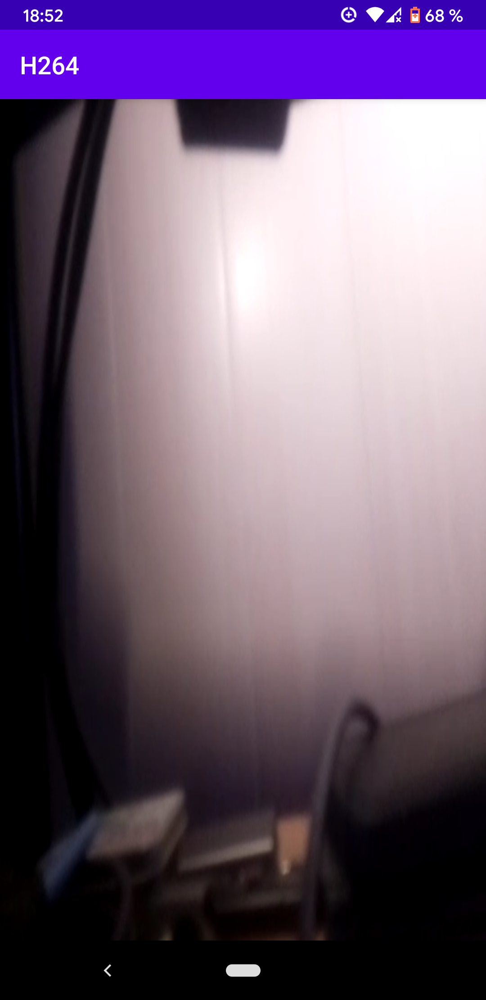

# Decoding H.264 with Android API

This sample is an Android Studio's project about decoding h264 flux with Android API.\
*H.264 is also named MPEG-4 AVC*

## H.264 flux

The h264 data consists of a multitude of NAL Units (NALU). Each NAL Unit start with a `0x00 0x00 0x00 0x01` or `0x00 0x00 0x01` sequence of bits (depending of the encoder) and contain either meta-data relative to the h264 format, either partial or full frame.\
[See this for more information about H.264](https://yumichan.net/video-processing/video-compression/introduction-to-h264-nal-unit/)

In our case the h264 data is written in a file and streamed through the TCP/IP protocol to simulate streaming.

## Android MediaCodec

In short there are four things to do:

- Adding a [`SurfaceView`](https://developer.android.com/reference/android/view/SurfaceView) to our layout.
- Implement [`SurfaceHolder.Callback`](https://developer.android.com/reference/android/view/SurfaceHolder.Callback) to handle some events relative to the SurfaceView.
- Instantiate a [`MediaCodec`](https://developer.android.com/reference/android/media/MediaCodec) object, and fill its buffers with NAL Unit (**one NAL Unit by buffer**).
- Filling the MediaCodec's buffers and rendering them. These two parts use blocking function, so we must use two threads (runnable, asynkTask or assimillable). One request for empty buffers and fill them, the second wait for decoded frames and trigger their rendering. *Since Android LOLLIPOP (API 21) [`MediaCodec.Callback`](https://developer.android.com/reference/android/media/MediaCodec.Callback) can be used for this.*

### More about the MediaCodec

To instantiate a `MediaCodec` simply use [`createDecoderByType(String type)`](https://developer.android.com/reference/android/media/MediaCodec#createDecoderByType(java.lang.String)). Since Android LOLLIPOP (API 21) we have to use [`createByCodecName(String type)`](https://developer.android.com/reference/android/media/MediaCodec#createByCodecName(java.lang.String)), the name of the buffer is retrieve by instantiate a [`MediaCodecList`](https://developer.android.com/reference/android/media/MediaCodecList) and use [`MediaCodecList.findDecoderForFormat`](https://developer.android.com/reference/android/media/MediaCodecList#findDecoderForFormat(android.media.MediaFormat)) passing it a `MediaFormat` obtained with [`MediaFormat.createVideoFormat(String mime, int width, int height)`](https://developer.android.com/reference/android/media/MediaFormat#createVideoFormat(java.lang.String,%20int,%20int)) where `mime` is `"video/avc"` and `width/height` the `SurfaceView.getWidth/.getHeight()`.

In all cases the `MediaCodec` must be `configure (MediaFormat format, Surface surface, int flags, MediaDescrambler descrambler)`, passing it a `MediaFormat` created with `createVideoFormat (String mime, int width, int height)` (where `mime` is `"video/avc"`), a `Surface` getting from the `SurfaceView.getHolder().getSurface()` and other can be `null`.

Finnaly we have to `start()` the `MediaCodec` and fill their buffers with NAL Unit (**one NAL Unit by buffer**) using `dequeueInputBuffer (long timeoutUs)` to obtain the ID/index of a free buffer and retrieve it in the buffers array obtained with [`getInputBuffers()`](https://developer.android.com/reference/android/media/MediaCodec#getInputBuffers()). Since Android LOLLIPOP (API 21) the buffer is obtained directly by calling [`getInputBuffer(int index)`](https://developer.android.com/reference/android/media/MediaCodec#getInputBuffer(int)) with its index.\
When the buffer is filled with the NAL Unit you can `queueInputBuffer (int index, int offset, int size, long presentationTimeUs, int flags)`\* for the MediaCodec proceed it.\
Because `dequeueInputBuffer (long timeoutUs)` is blocking you must do this in a separate thread.\
\**(in our case the parameter `long presentationTimeUs` is not used, this information is find by the MediaCodec in a NAL Unit, set it to `0`, and flags is not used too, set it to `0`)*

In parallel we have to `dequeueOutputBuffer (MediaCodec.BufferInfo info, long timeoutUs)`. That function is bloking and return an `int` [which can be a sepcial value](https://developer.android.com/reference/android/media/MediaCodec#dequeueOutputBuffer(android.media.MediaCodec.BufferInfo,%20long)) indicate some stats of the Mediacodec (like the numbers of outBuffers has changed, ...) or an index of a buffer ready to be automatically rendered to the `SurfaceView` by call to `releaseOutputBuffer (int index, boolean render)`.\
Because `dequeueOutputBuffer (MediaCodec.BufferInfo info, long timeoutUs)` is blocking you must do this in a separate thread.

Optionally we can handle the end of the stream by setting the flag `MediaCodec.BUFFER_FLAG_END_OF_STREAM` on the last `queueInputBuffer (int index, int offset, int size, long presentationTimeUs, int flags)` call. This call can be an empty additional buffer. The flag can be intercept in the `info` parameter of [`dequeueOutputBuffer (MediaCodec.BufferInfo info, long timeoutUs)`](https://developer.android.com/reference/android/media/MediaCodec#dequeueOutputBuffer(android.media.MediaCodec.BufferInfo,%20long))

Don't forget to `stop()` and `release()` the MediaCodec.

## Difficulty

**We have to fill each buffer with only one entire NAL Unit.**
The hard part, it is to parse the NAL Unit. In our case the h264 data is streamed with socket so **we can't garantee that the socket's buffer is filled with complete NAL Unit**.\
In fact, the last bits containing in the socket's buffer can be a part of the start sequence of the **next** NAL Unit. For example the buffer's socket can end with `0x00 0x00 0x00` and the missing `0x01` will be the first bit read at the next reading of the socket buffer. **So we must retain the last bits** (size of NAL unit start sequence -1\*) and include them in the next read step (in my case the last bits are copied at the start of the buffer and bits read from the socket copied just after).

\**-1 because in the worst case (case when we have to retain the maximum of bits) is missing only the last bit. So, at maximum, we have to keep size of the start sequence -1*

**Don't forget the manifest file we must declare the internet permission `<uses-permission android:name="android.permission.INTERNET" />`.**

## Server - Client

For this exemple it is not a commun client-server model. The phone wait until a program connect to it and start streaming to it.\
For exemple I have a minimal Python script which send a sample to the phone (in multipart for simulating streaming) can be found on my <https://github.com/Seb-C89/H264-Serv>\
Or you can stream an H264 flux from any software, for example from a Raspberry Pi with the "Pi camera" `raspivid -w 640 -h 480 -t 60000 -o - | nc 192.168.1.13 54596` *(la commande `nc` est suivi de l'adresse IP et du port du téléphone)*

## Sample

The h264 sample can be recorded from a Raspberry with the [picamera lib](https://picamera.readthedocs.io/en/release-1.13/) or from the command line `raspivid -t 5000 -o Desktop/video.h264`
You can dowload my sample <https://1drv.ms/u/s!At9WEvfyjLgEhWBTkWyAnONRVyPz?e=b44wbW>

## Support

Android 4.1 JELLY_BEAN (API Level 16) and newer

Works on :

- LG Leon LG-H320 / Android 5.0.1
- Google Pixel 3A / Android 11

Don't works on :

- Sony Xperia SP C5303 / Android 4.1.2

## See

<https://yumichan.net/video-processing/video-compression/introduction-to-h264-nal-unit/>
<https://en.wikipedia.org/wiki/Network_Abstraction_Layer>
<https://developer.android.com/reference/android/media/MediaCodec>

## Screenshot

